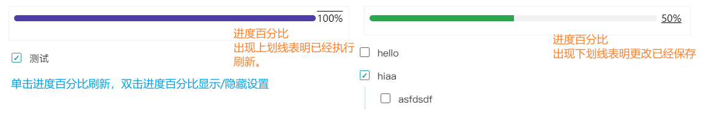
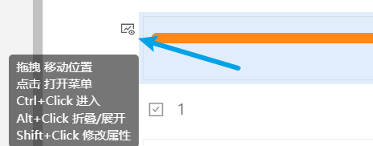
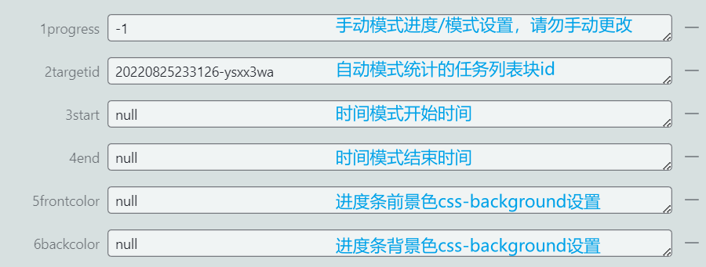

## progress Bar T 进度条

> 当前版本： v0.0.1-从这里开始

> 展示进度条的思源笔记挂件。

- “自动”模式：绑定任务列表，计算任务列表第一层级完成进度；[^1]
- 手动模式：鼠标拖拽/点击设定进度；
- 时间模式：显示时间段进度；

## 设置&使用方式

### 界面




- 双击刷新按钮切换模式；
- 单击刷新按钮触发进度计算/手动模式保存进度；
- 修改挂件属性后单击刷新按钮应用设置；

### 使用说明

目前本挂件未在界面上安排设置位置，相关设定需要在挂件属性中修改。

挂件块属性设置方法：鼠标在挂件中时，`shift+左键点击`挂件块左上角块标。（或左键点击块标，点击`属性`）。




#### 自动模式

> 自动模式下刷新按钮边框为实线。

复制已经存在的任务列表块id（<u>容器块、不是列表项块</u>）到`2targetid`属性中，点击确定保存属性，在挂件中点击刷新按钮应用更改。


- 双击`Fn`按钮：取消/完成`2targetid`对应的**全部**任务列表项。

> 鼠标悬停在刷新按钮上，有`(API)`标注时，无法在修改任务列表块后自动刷新，需要手动点击刷新按钮计算进度。

#### 手动模式

> 手动模式下刷新按钮边框为短线。

点击进度条对应位置设定进度，然后点击刷新按钮保存进度，默认将在手动更改后1.5秒自动保存。

#### 时间模式

> 时间模式下刷新按钮边框为点。

分别设置挂件块属性`3start`、`4end`为开始时间和结束时间。挂件接受的时间字符串格式为：（年、月、日、时、分之间需要使用任意的非数字字符隔开）

- `YYYY MM DD`（年 月 日），例如`2020.1.1`
- `YYYY MM DD HH MM` （年 月 日 时 分），例如`2020.1.1 12.20`
- `HH MM`（将在计算进度时自动补全为挂件<u>运行时当天</u>对应时间，用于展示当天进度），例如`12.20`

若为20xx年，年份数字可只写后两位。

### 属性设置示例




- `1progress`：进度条模式/手动模式进度保存，请勿手动更改；
  - [0, 100]手动模式；
  - -1自动模式；
  - -2时间模式；

- `2targetid`：自动模式下，将计算该id对应的任务列表块进度；
  - `20220823231306-1ud2gjv`；

- `3start`：时间模式开始时间；
  - 年 月 日 时 分`2022-6-8 12:20`；
  - 年 月 日`2022-6-8`   `2022 6 8`    `22-6-8`；
  - 时 分`22:22`；

- `4end`：时间模式结束时间；
- `5frontcolor`：进度条前景色（已完成部分颜色）css(background)，这里的设定将应用于进度条css的`background`，设置后点刷新生效；
  - 红绿蓝`rgb(255, 0, 0)`；
  - 红绿蓝不透明度`rgba(216, 228, 229, 0.737)`；
  - 线性渐变`linear-gradient(to right , #7A88FE, #7AFFB0)`；（显示效果一般）

- `6backcolor`：进度条背景色（未完成部分颜色）css(background)；

- `7alltask`：~~自动模式统计包括子任务的所有任务完成进度~~ ；
  - 不建议使用，详见注意，请设置为`false`；

### 自定义设置

打开`${思源data目录}/widget/progressBar/src/config.js`，可进行自定义设置，请参考设置项旁边的说明。以下是一些可能常用的设置项：

- 手动模式操作后自动保存延迟`saveAttrTimeout`；
- 自动模式API统计时自动计算间隔`refreshInterval`；
- 自定义挂件属性名称`manualAttrName`、`autoTargetAttrName`、`startTimeAttrName`、`endTimeAttrName`等；
- 自动模式：如果块不存在则创建块`createBlock`；
- 显示/隐藏自动模式Fn按钮：`taskFunction`；

打开`${思源data目录}/widget/progressBar/static/progressbar.css`，可编辑进度条显示样式，例如：

- 进度条默认颜色，或其他默认进度条样式；
- 按钮样式，等；

## ⚠️注意

> 由于开发者能力有限，挂件还存在一些问题。

- 理论上，自动模式通过页面直接计算任务进度，但有些情况将切换为API统计，需手动点击刷新按钮更新进度。例如：
  - 任务列表和进度条不在同一页面；
  - 任务列表和进度条相距较远；
  - 因为挂件未更新而在新版本失效；
- 没有设置界面，需要自行设定挂件属性；
- 任务完成/取消完成勾选的变动，通过MutationObserver获取对应任务节点的class属性变化实现，频繁高亮、选中任务列表块可能导致卡顿；
- 关于`7alltask`统计包括子节点在内的进度：
  - 上一层级任务（父任务）完成，其下子任务不会被认为完成，父任务、子任务统计时权重相同；
  - 在进行大量任务节点增删时，会反复触发MutaionObserver（节点变动监视）重设，可能导致卡顿；


### 附录--颜色设定示例

> P.S.这是由开发者提供的颜色，这里的颜色都不太好看。另外，建议背景色有点透明度。

| 颜色       | 已完成（前景色）`5frontcolor` | 未完成（背景色）`6backcolor` |
| ---------- | ----------------------------- | ---------------------------- |
| 暗橙       | rgb(175, 72, 27)              | rgba(176, 176, 176, 0.25)    |
| 淡绿       | rgb(22,170,157)               | rgba(197, 229, 234, 0.2)     |
| 亮橙       | rgb(255, 123, 0)              | rgba(233, 215, 199, 0.2)     |
| 蓝         | rgb(0, 128, 207)              | rgba(216, 228, 229,0.25)     |
| 蓝2        | rgb(40, 170, 219)             |                              |
| 洋红       | rgb(203, 64, 108)             |                              |
| 红         | rgb(255, 84, 84)              | rgba(255, 231, 231, 0.25)    |
| 红-较深    | rgb(218,57,57)                |                              |
| 绿（默认） | rgb(45,164,78)                | rgba(175,184,193,0.2)        |


## 反馈bug

请到github仓库[新建issue](https://github.com/OpaqueGlass/listChildDocs/issues/new/choose)。

## 参考&感谢

开发过程中参考了以下网络博客：

| 博客原文-作者                                                | 备注           |
| ------------------------------------------------------------ | -------------- |
| https://blog.csdn.net/m0_47214030/article/details/117911609 作者：[☆*往事随風*☆](https://blog.csdn.net/m0_47214030) | 进度条鼠标拖拽 |


### 依赖

1. jQuery （本项目中通过jQuery选择页面元素）；

```
jQuery JavaScript Library v3.6.0  https://jquery.com/
Copyright OpenJS Foundation and other contributors
Released under the MIT license  https://jquery.org/license
```

[^1]: 计算默认使用DOM统计任务列表进度、配合MutationObserver在任务列表变化时触发重新统计，但在一些条件下无法使用，详见“注意”一节；
