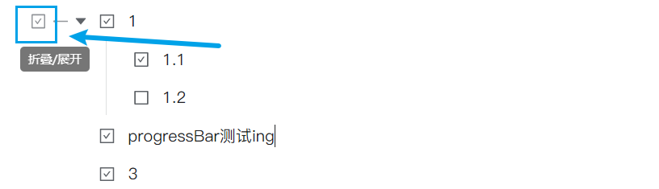

## progress Bar T 进度条

[With limited English support](https://github.com/OpaqueGlass/progressBarT-sywidget/blob/main/README_en.md)

> 当前版本： v0.2.0 **改进**：改进时间模式布局；
> **新增**：重设挂件高度选项；
> **改进**：设置时间时，自动模式支持显示截止日；
> **改进**：增加英文支持；

> 展示进度条的思源笔记挂件。

- “自动”模式：绑定任务列表，计算任务列表第一层级完成进度；[^1]
- 手动模式：鼠标拖拽/点击设定进度；
- 时间模式：显示时间段进度；

## 快速开始

- 操作：
  - 双击进度条右侧的文字：显示或隐藏设置；
  - 自动模式仅能统计挂件紧邻的列表或手动设定的列表；
  - （隐藏进度条右侧文字时，请点击显示进度百分比的文字）；

  

  
- 操作成功提示：
  - 成功刷新时，进度百分比将显示上划线；
  - 成功保存时，进度百分比将显示下划线；
- 模式：
  - 单击进度条右侧的文字：刷新/手动模式保存；
  - 手动输入时间模式日期时，需要满足`年月日时分之间用非数字的字符隔开`的条件，例：`2023年4月14日`、`23:23`；
- 其他：
  - 文档打开时挂件由长再变短，影响体验？点击“重设挂件高度”按钮或手动拖拽保存一下高度；

> 强烈建议完整阅读此文档；

## 设置&使用方式

### 模式说明

#### 自动模式

默认情况下（任务列表块id为空时），挂件将自动获取**下方紧邻的**任务列表块并计算其进度。（若下方没有任务列表块，则获取挂件上方紧邻的任务列表块）

您也可以复制已经存在的任务列表块id（<u>不是列表项块</u>）到设置->任务列表块id中，点击“保存设置”按钮在挂件中应用更改。




自动模式下，双击`Fn`按钮（需要点开设置才能看到）：取消/完成块id对应的**全部**任务列表项。

> 鼠标悬停在刷新按钮上，有`(API)`标注时，无法在修改任务列表块后自动刷新，需要手动点击刷新按钮计算进度。

#### 手动模式

点击进度条对应位置设定进度，然后点击刷新按钮保存进度，默认将在手动更改后0.5秒自动保存。

进度百分比下方出现下划线并随后消失，表明已经成功保存设定，请确定保存成功后再关闭文档。

#### 时间模式

设置开始时间、结束时间，然后点击“保存设置”按钮。

**挂件接受的时间字符串格式**为：（年、月、日、时、分之间需要使用任意的非数字字符隔开，小时为24小时制）

- `yyyy MM dd`（年 月 日），例如`2020.1.1` `2020年1月1日`
- `yyyy MM dd HH mm` （年 月 日 时 分），例如`2020.1.1 12.20`
- `HH mm`（将在计算进度时自动补全为挂件<u>运行时当天</u>对应时间，用于展示当天进度），例如`12.20` `12:20`

> 若为20xx年，年份数字可只写后两位。

请注意：时间模式下，进度刷新频率由`config.js`设定（请参考自定义设置），默认10分钟刷新一次；

#### v0.0.1兼容性说明

- 设置项可以在挂件内配置，也可直接修改属性配置，但同时只能使用一种方式设定，请避免混用；
- 如果使用css background特有方式设定进度条外观，请在属性保存，并避免在挂件内保存外观设定，挂件内保存外观设定只接受颜色；
- 之前在css中设定的进度条颜色将无效，请在`config.js`设定；
- 如果出现问题，请尝试在文档中删除挂件后重新添加。


### 自定义设置

打开`${思源data目录}/widgets/progressBarT/static/progressbar.css`，可编辑进度条显示样式，例如：

-  ~~进度条默认颜色；~~ 请注意，进度条颜色设定迁移至config.js设置；
- 按钮样式，等；

#### 在`config.js`中直接更改设置

打开`${思源data目录}/widgets/progressBarT/src/config.js`，可进行自定义设置，请参考设置项旁边的说明。以下是一些可能常用的设置项：

- 手动模式操作后自动保存延迟`saveAttrTimeout`；
- 自动模式API统计时自动计算间隔`refreshInterval`；
- 自定义挂件属性名称`manualAttrName`、`autoTargetAttrName`、`startTimeAttrName`、`endTimeAttrName`等；
- 自动模式：如果块不存在则创建块`createBlock`；
- 时间模式：定时刷新间隔`timeModeRefreshInterval`；
- 显示进度条右侧的刷新和设置按钮`showButtons`；

#### 在`custom.js`中覆盖设置

> 测试中，可能存在缺陷。

创建或编辑`${思源data目录}/widgets/custom.js`，仅支持`config.js`文件中defaultAttr（创建挂件时的默认设置）、setting（全局设置）下的设置项，以下是一个示例。

```javascript
/*方案1：若之前有config，需要添加progressBarT的部分*/
export const config = {
    token: "",
    progressBarT:{/*若之前有config，则只加入progressBarT的部分*/
        setting: { // 和config.js中setting对应
            showButtons: true
        },
        defaultAttr: {// 和config.js 中 defaultAttr对应
            frontColor: "rgba(255, 255, 255, 1)", //前景色更改
            barWidth: 12, //进度条宽度
            frontColorSelector: {//前景色颜色选择器配置（jscolor），像这样复杂的设置项，如果有更改，必须重新自定义全部属性，不能只自定义部分属性
              value: 'rgba(51,153,255,0.5)',
              position: 'bottom',
              height: 80,
              backgroundColor: '#333',
              palette: 'rgba(0,0,0,0) #2da44eff #f1993eff #0080cfff #cb406cff #ff5454ff #af481bff #269affff',//预设颜色组
              paletteCols: 11,
              hideOnPaletteClick: true
            },
        }
    }
   /*...其他挂件的自定义设置*/
};
```

```javascript
/*方案2 单独配置export*/
export const progressBarT = {
    setting: { // 和config.js中setting对应
        showButtons: true
    },
    defaultAttr: {// 和config.js 中 defaultAttr对应
        frontColor: "rgba(255, 255, 255, 1)", //前景色更改
        barWidth: 12 //进度条宽度
    }
}
```


## ⚠️注意

> 由于开发者能力有限，挂件还存在一些问题。

- 理论上，自动模式通过页面直接计算任务进度，但有些情况将切换为API统计，需手动点击刷新按钮更新进度。例如：
  - 任务列表和进度条不在同一页面；
  - 任务列表和进度条相距较远；
  - 因为挂件未更新而在新版本失效；
- 没有设置界面，需要自行设定挂件属性；
- 任务完成/取消完成勾选的变动，通过MutationObserver获取对应任务节点的class属性变化实现，频繁高亮、选中任务列表块可能导致卡顿；
- 关于`7alltask`统计子任务功能：
  - 上一层级任务（父任务）完成，其下子任务不会被认为完成，父任务、子任务统计时权重相同；
  - 在进行大量任务节点增删时，会反复触发MutaionObserver（节点变动监视）重设，可能导致卡顿；

## 反馈bug

请到github仓库[新建issue](https://github.com/OpaqueGlass/progressBarT-sywidget/issues/new)；

如您无法访问github仓库，请直接在ld246社区发帖，并@Undii。

## 参考&感谢

开发过程中参考了以下网络博客：

| 博客原文-作者                                                | 备注           |
| ------------------------------------------------------------ | -------------- |
| https://blog.csdn.net/m0_47214030/article/details/117911609 作者：[☆*往事随風*☆](https://blog.csdn.net/m0_47214030) | 进度条鼠标拖拽 |

开发过程中参考了以下大佬的项目：

| github仓库 / 开发者 | 开源协议 | 备注 |
| ----------------| --------| --------------|
| [widget-query](https://github.com/Zuoqiu-Yingyi/widget-query) / [Zuoqiu-Yingyi](https://github.com/Zuoqiu-Yingyi) | AGPL-3.0 | 从custom.js导入自定义设置 |


### 依赖

1. jQuery （本项目中通过jQuery选择页面元素）；

```
jQuery JavaScript Library v3.6.0  https://jquery.com/
Copyright OpenJS Foundation and other contributors
Released under the MIT license  https://jquery.org/license
```

2. jsColor

开源协议：[GNU GPL v3](http://www.gnu.org/licenses/gpl-3.0.txt)

官方网站：[https://jscolor.com/download/](https://jscolor.com/download/)

### 图标

1. [刷新按钮图标](https://www.iconfinder.com/icons/5402417/refresh_rotate_sync_update_reload_repeat_icon)，作者：[amoghdesign](https://www.iconfinder.com/amoghdesign)，许可协议：[CC3.0 BY-NC](http://creativecommons.org/licenses/by-nc/3.0/)；

2. [设置按钮图标](https://www.iconfinder.com/icons/5925600/control_options_settings_icon)，作者：[IconPai](https://www.iconfinder.com/iconpai)，许可说明：Free for commercial use (Include link to authors website)；


[^1]: 计算默认使用DOM统计任务列表进度、配合MutationObserver在任务列表变化时触发重新统计，但在一些条件下无法使用，详见“注意”一节；
