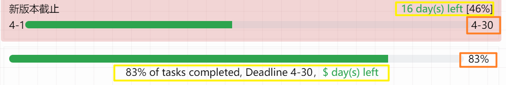
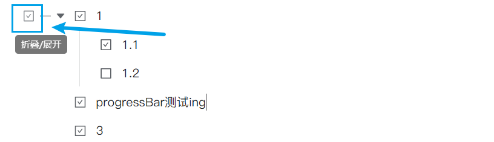

## progress Bar T

> This document was translated by Google Translate without manual checking. The author cannot guarantee the accuracy of the translation results.
>
> Note that some text (such as date) is not internationalized.

> Current Version: v0.1.3 **Improved**: Improve time mode layout;
> **NEW**: Reset widget height option;
> **Improved**: When setting the time, the automatic mode supports displaying the deadline;
> **Improved**: Add limited English support;

> Siyuan note widget showing the progress bar.

- "Automatic" mode: bind the task list and calculate the completion progress; [^1]
- Manual mode: drag/click to set the progress;
- Time mode: display the progress of the time period;

## Quick start

- operation:
   - Double-click the text on the right side of the progress bar: show or hide settings;
   - Automatic mode can only count the list next to the widget or the list set manually;
   - (When hiding the text on the right side of the progress bar, please click the text showing the progress percentage);

   

   
- Tips for successful operation:
   - When successfully refreshed, the progress percentage will be overlined;
   - When saving successfully, the progress percentage will be underlined;
- modes:
   - Click the text on the right side of the progress bar: Refresh/Save in manual mode;
   - When manually entering the date in the time mode, it is necessary to meet the condition of "year, month, day, hour and minute separated by non-numeric characters", for example: `2023-1-1`, `23:23`;
- other:
   - When the document is opened, the widget changes from long to short, which affects the experience? Click the "Reset Widget Height" button or manually drag and drop to save the height;

> It is strongly recommended to read this document in its entirety;

## Setup & Usage

### Mode Description

#### Automatic Mode

By default (when the task list block id is empty), the widget will automatically get the **task list block immediately below and calculate its progress. (If there is no task list block below, get the task list block immediately above the widget)

You can also copy an existing task list block id (<u>not a list item block</u>) to Settings->Task List block id, click the "Save Settings" button to apply the changes in the widget.




In automatic mode, double-click the `Fn` button (you need to open the settings to see it): cancel/complete **all** task list items corresponding to the block id.

> When the mouse hovers on the refresh button, when there is `(API)` marked, it cannot be automatically refreshed after modifying the task list block, and you need to manually click the refresh button to calculate the progress.

#### Manual mode

Click the corresponding position of the progress bar to set the progress, and then click the refresh button to save the progress. By default, it will be automatically saved 0.5 seconds after the manual change.

An underline appears under the progress percentage and then disappears, indicating that the settings have been successfully saved. Please confirm that the save is successful before closing the document.

#### Time Mode

Set the start time, end time, and click the "Save Settings" button.

**The time string format accepted by the widget** is: (year, month, day, hour, and minute need to be separated by any non-numeric characters, and the hour is in 24-hour format)

- `yyyy MM dd` (year month day), such as `2020.1.1` `2020.1.1`
- `yyyy MM dd HH mm` (year month day hour minute), for example `2020.1.1 12.20`
- `HH mm` (will be automatically completed when calculating the progress as the corresponding time of the widget <u>running day</u>, used to display the progress of the day), such as `12.20` `12:20`

> If it is 20xx, only the last two digits of the year number can be written.

Please note: In the time mode, the progress refresh frequency is set by `config.js` (please refer to the custom settings), and the default is to refresh once every 10 minutes;

#### v0.0.1 compatibility instructions

- Setting items can be configured in the widget, or directly modify the attribute configuration, but only one method can be used at the same time, please avoid mixing them;
- If you use the unique method of css background to set the appearance of the progress bar, please save it in the property, and avoid saving the appearance setting in the widget. The appearance setting saved in the widget only accepts the color;
- The progress bar color previously set in css will be invalid, please set it in `config.js`;
- If something goes wrong, try removing the widget in the document and adding it again.


### Custom settings

Open `${Siyuan data directory}/widgets/progressBarT/static/progressbar.css` to edit the display style of the progress bar, for example:

- ~~ The default color of the progress bar; ~~ Please note that the color setting of the progress bar is migrated to the config.js setting;
- button styles, etc.;

#### Changing settings directly in `config.js`

Open `${Siyuan data directory}/widgets/progressBarT/src/config.js` for custom settings, please refer to the description next to the setting items. Here are some settings that may be commonly used:

- Automatic save delay `saveAttrTimeout` after manual mode operation;
- Automatic calculation interval `refreshInterval` when API statistics in automatic mode;
- Custom widget attribute names `manualAttrName`, `autoTargetAttrName`, `startTimeAttrName`, `endTimeAttrName`, etc.;
- automatic mode: create block `createBlock` if block does not exist;
- Time mode: timed refresh interval `timeModeRefreshInterval`;
- Show refresh and set button `showButtons` to the right of the progress bar;

#### Override settings in `custom.js`

> During testing, there may be bugs.

Create or edit `${Siyuan data directory}/widgets/custom.js`, only support the setting items under defaultAttr (the default setting when creating widgets) and setting (global settings) in the `config.js` file, the following is a example.

```javascript
/*Scheme 1: If there is config before, you need to add the part of progressBarT*/
export const config = {
     token: "",
     progressBarT:{/*If there is config before, only add the part of progressBarT*/
         setting: { // corresponds to setting in config.js
             showButtons: true
         },
         defaultAttr: {// corresponds to defaultAttr in config.js
             frontColor: "rgba(255, 255, 255, 1)", // change the front color
             barWidth: 12, // progress bar width
             frontColorSelector: {//Foreground color color selector configuration (jscolor), if such a complex setting item is changed, all attributes must be re-customized, not only some attributes
               value: 'rgba(51,153,255,0.5)',
               position: 'bottom',
               height: 80,
               backgroundColor: '#333',
               palette: 'rgba(0,0,0,0) #2da44eff #f1993eff #0080cfff #cb406cff #ff5454ff #af481bff #269affff',//preset color group
               paletteCols: 11,
               hideOnPaletteClick: true
             },
         }
     }
    /*...custom settings for other widgets*/
};
```

```javascript
/*Scheme 2 configure export separately*/
export const progressBarT = {
     setting: { // corresponds to setting in config.js
         showButtons: true
     },
     defaultAttr: {// corresponds to defaultAttr in config.js
         frontColor: "rgba(255, 255, 255, 1)", // change the front color
         barWidth: 12 //Progress bar width
     }
}
```


## ⚠️ Note

> Due to the limited ability of developers, there are still some problems in the widget.

- In theory, the automatic mode calculates the task progress directly through the page, but in some cases, it will switch to API statistics, and you need to manually click the refresh button to update the progress. For example:
   - Task list and progress bar are not on the same page;
   - The task list and the progress bar are far apart;
   - Invalid in the new version because the widget has not been updated;
- There is no setting interface, you need to set the widget properties by yourself;
- The change of task completion/cancellation is achieved by obtaining the change of the class attribute of the corresponding task node through MutationObserver. Frequent highlighting and selection of task list blocks may cause freezes;
- About `7alltask` statistical subtask function:
   - When the task of the previous level (parent task) is completed, the sub-tasks below it will not be considered as completed, and the weight of the parent task and sub-tasks is the same when counting;
   - When a large number of task nodes are added or deleted, the MutaionObserver (node change monitoring) reset will be triggered repeatedly, which may cause freezes;

## Feedback bugs

Please go to the github repository and [create a new issue](https://github.com/OpaqueGlass/progressBarT-sywidget/issues/new);

## References & Thanks

The following web blogs were referenced during the development process:

| Original Blog - Author | Remarks |
| -------------------------------------------------- ----------- | -------------- |
| https://blog.csdn.net/m0_47214030/article/details/117911609 Author: [☆*The past follows the wind*☆](https://blog.csdn.net/m0_47214030) | Progress bar mouse drag |

During the development process, the following projects (created by awesome developer) were referred to:

| github warehouse / developer | Open source agreement | Remarks |
| ----------------| --------| --------------|
| [widget-query](https://github.com/Zuoqiu-Yingyi/widget-query) / [Zuoqiu-Yingyi](https://github.com/Zuoqiu-Yingyi) | AGPL-3.0 | From custom. js import custom settings |


### Dependencies

1. jQuery (select page elements through jQuery in this project);

```
jQuery JavaScript Library v3.6.0 https://jquery.com/
Copyright OpenJS Foundation and other contributors
Released under the MIT license https://jquery.org/license
```

2. jsColor

Open source license: [GNU GPL v3](http://www.gnu.org/licenses/gpl-3.0.txt)

Official website: [https://jscolor.com/download/](https://jscolor.com/download/)

3. [layDate](http://www.layui.com/laydate/)

```
http://www.layui.com/laydate/
https://github.com/layui/laydate
MIT license 
```

### icon

1. [Refresh button icon](https://www.iconfinder.com/icons/5402417/refresh_rotate_sync_update_reload_repeat_icon), author: [amoghdesign](https://www.iconfinder.com/amoghdesign), license agreement: [CC3. 0 BY-NC](http://creativecommons.org/licenses/by-nc/3.0/);

2. [Settings button icon](https://www.iconfinder.com/icons/5925600/control_options_settings_icon), author: [IconPai](https://www.iconfinder.com/iconpai), license description: Free for commercial use (Include link to authors website);


[^1]: The calculation uses DOM to count the progress of the task list by default, and cooperates with MutationObserver to trigger re-statistics when the task list changes, but it cannot be used under some conditions, see the "Note" section for details;